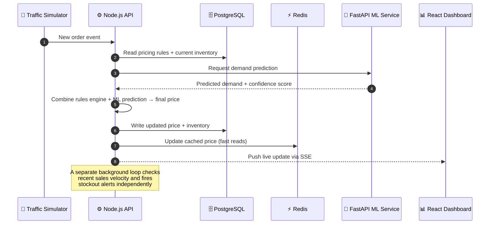

# SurgeOps

[](https://github.com/Kalpesh2409/surgeops/actions/workflows/ci.yml)

**Live demo:** [surgeops-web.onrender.com](https://surgeops-web.onrender.com)

> Hosted on a free-tier server. If the site hasn't been visited in a while, the first request can take up to ~50 seconds to wake up — please wait a moment on first load.

## Try It Yourself

| Field | Value |
|---|---|
| URL | [surgeops-web.onrender.com](https://surgeops-web.onrender.com) → Staff Login |
| Email | `demotest@example.com` |
| Password | `Demo1234!` |
| Role | Regional Manager (full read access across all stores; write actions are disabled on this account by design) |

## Demo

<!-- TODO: Add demo GIF/recording here once captured. Suggested: record a full flow via `/simulator/demo-ramp` showing prices climbing from Normal → Elevated → Surge on the dashboard. -->

## Problem Statement

Dark stores in Indian quick-commerce operate on thin margins against highly volatile, hyperlocal demand — a heatwave spikes cold-drink orders, a downpour spikes staples, and static pricing/inventory rules can't keep up. Manual price reviews lag the spike; fixed markups leave margin on the table during stockout-risk windows; and inventory imbalances between stores go unaddressed.

**SurgeOps** simulates a real-time pricing and inventory system across four dark stores (Bandra West, Kothrud, Koramangala, Noida), pairing a rules engine with an ML demand model so the two can cross-check each other — with live state pushed to a dashboard via SSE.

## Tech Stack

| Layer | Technology |
|---|---|
| API | Node.js, Express, TypeScript |
| ML Service | Python, FastAPI, scikit-learn |
| Database | PostgreSQL, Prisma ORM |
| Cache / Real-time state | Redis (ioredis) |
| Frontend | React, TypeScript, Tailwind CSS v4, shadcn/ui |
| Real-time updates | Server-Sent Events (SSE) |
| Pricing explanations | Rule-based engine (deterministic, no external API) |
| Infra (local dev) | Docker Compose |
| Hosting | Render (API, ML service, and frontend, each as a separate service) |
| CI/CD | GitHub Actions |

**Why these choices:**

- **Node.js + Express + TypeScript for the API** — type safety across a system with many moving pieces (pricing, inventory, simulator), and a mature ecosystem for building REST + SSE endpoints quickly.
- **Python + FastAPI + scikit-learn for ML, as a real server (not Jupyter)** — scikit-learn is the standard choice for a tabular regression problem like demand prediction, and FastAPI serves it as an actual microservice the Node API calls over HTTP — closer to how ML is deployed in production than a notebook would be.
- **PostgreSQL + Prisma** — relational data (stores, products, orders, price history) fits a relational model well, and Prisma gives type-safe queries and migrations without hand-written SQL.
- **Redis** — sub-second reads for live pricing/inventory state without hitting Postgres on every request, and backs the app's rate limiting.
- **SSE over WebSockets** — the data flow is one-directional (server → dashboard), so SSE gives real-time push with a simpler protocol and no need for bidirectional messaging.
- **Rule-based pricing explanations, not an LLM** — an earlier version called the Gemini API to explain price changes in plain language. It was replaced with a deterministic, rule-based explanation builder after the LLM approach produced explanations that occasionally went stale or mismatched the actual price shown — the rule-based version is instant, has no rate limits, and always matches the real numbers.
- **No message queue for MVP** — order volume in this simulation doesn't warrant the operational overhead of a queue; direct service calls keep the system simpler to reason about and to run at ₹0 cost.
- **Docker Compose (local dev)** — spins up Postgres and Redis together with one command for local development; the deployed version runs each service independently on Render.
- **GitHub Actions** — free CI for a private repo, with real Postgres/Redis service containers so tests run against real infra, not mocks.

## Architecture

The lifecycle of a single price update, from simulated order to live dashboard:



## Project Structure

\`\`\`
surgeops/
├── .github/                      # GitHub Actions CI workflows
├── apps/
│   ├── api/                      # Node.js + Express + TypeScript API
│   │   ├── prisma/
│   │   │   ├── migrations/
│   │   │   ├── seed/
│   │   │   └── schema.prisma
│   │   ├── scripts/
│   │   │   ├── createInitialUsers.ts
│   │   │   ├── resetDemoData.ts
│   │   │   ├── runMlPricingSuggestions.ts
│   │   │   └── seedHistory.ts
│   │   └── src/
│   │       ├── __tests__/
│   │       ├── lib/                # prisma client, redis client, sseManager, inventoryStatus
│   │       ├── middleware/         # auth, errorHandler, blockDemoAccount
│   │       ├── routes/             # analytics, auth, health, inventory, pricing, simulator, stores, stream, users
│   │       ├── services/           # pricingEngine, mlPricingSuggester, explanationBuilder,
│   │       │                       # demandIngestionLoop, orderSimulator, priceUpdateWriter, etc.
│   │       ├── app.ts
│   │       └── index.ts
│   ├── docs/                     # Project docs (e.g. demo rehearsal scripts)
│   ├── ml/                       # Python + FastAPI + scikit-learn ML service
│   │   ├── main.py                 # FastAPI app entry point
│   │   ├── train.py                # Model training script
│   │   ├── build_features.py
│   │   ├── model.pkl / product_encoder.pkl / store_encoder.pkl / avg_demand.pkl
│   │   └── requirements.txt
│   └── web/                      # React + TypeScript + Tailwind frontend
│       ├── public/
│       └── src/
│           ├── assets/
│           ├── components/
│           │   ├── ui/              # shadcn/ui primitives (badge, button, card, select, etc.)
│           │   ├── __tests__/
│           │   └── ZoneCard.tsx, PriceTable.tsx, StoreSelector.tsx,
│           │       InventoryPanel.tsx, MlComparisonPanel.tsx, TrafficSimulator.tsx, etc.
│           ├── hooks/               # usePriceStream, useMlComparison, useAnimatedNumber
│           ├── lib/                 # utils, zoneHeat
│           ├── pages/                # Home, Login, AdminDashboard, ManageUsers, SalesAnalytics, About
│           ├── App.tsx
│           └── main.tsx
├── .env.example
├── docker-compose.yml             # Postgres + Redis (local dev)
├── LICENSE
└── README.md
\`\`\`


## Security

This isn't a toy demo left wide open — a few real protections are in place:

- **Rate limiting** on login attempts and on the Traffic Simulator's endpoints, to prevent abuse (exact thresholds intentionally not published here).
- **Role-based access control** — three roles (Admin, Regional Manager, Store Manager), each seeing a different set of pages and data. Store Managers are locked to their own store's data, enforced on the server, not just hidden in the UI.
- **Demo account write protection** — the public demo account can view everything but is blocked from creating, editing, deactivating, or deleting anything, enforced by a dedicated middleware layer.
- **Authenticated real-time updates** — the live SSE price stream requires a valid token, even though browsers' native `EventSource` API can't send standard auth headers (worked around via a short-lived signed token in the URL).
- **Soft-delete + confirmation for user removal** — accounts are deactivated before they can be permanently deleted, and permanent deletion requires re-typing the user's name to confirm.

## Setup & Run Instructions

### Prerequisites
- Node.js (v20+)
- Python 3.13
- Docker & Docker Compose

### 1. Clone and configure environment
```bash
git clone https://github.com/Kalpesh2409/surgeops.git
cd surgeops
cp .env.example .env
```

### 2. Start Postgres and Redis
```bash
docker-compose up -d
```

### 3. Set up and start the API (port 4000)
```bash
cd apps/api
npm install
npx prisma generate
npx prisma migrate dev
npx tsx prisma/seed/index.ts
npm run dev
```
API will be running at `http://localhost:4000`.

### 4. Set up and start the ML service (port 8000)
```bash
cd apps/ml
python -m venv venv
.\venv\Scripts\Activate.ps1   # Windows
# source venv/bin/activate    # macOS/Linux
pip install -r requirements.txt
uvicorn main:app --reload --port 8000
```

### 5. Set up and start the frontend
```bash
cd apps/web
npm install
npm run dev
```
Frontend will be running at the Vite dev URL shown in the terminal (typically `http://localhost:5173`).

### 6. Trigger a demo
```bash
curl -X POST http://localhost:4000/simulator/demo-ramp \
  -H "Content-Type: application/json" \
  -d '{"storeId": "store-mumbai-bandra"}'
```

## Key Features
- **Real-time SSE dashboard** — live pricing and inventory updates pushed to the frontend as they happen, no polling
- **Rules engine + ML cross-check** — a deterministic pricing engine runs alongside a scikit-learn demand model, surfacing both for comparison
- **Plain-language pricing explanations** — a rule-based engine explains *why* a price changed, instantly and with no external dependency
- **4 simulated dark stores** — Mumbai Bandra West, Pune Kothrud, Bangalore Koramangala, Delhi Noida, each with independent pricing/inventory state
- **Traffic Simulator** — inject synthetic demand events to trigger surge pricing scenarios on demand, without waiting for real traffic
- **Predictive stockout alerts** — flags products projected to run out within hours, based on recent sales velocity
- **Role-based dashboards** — Admin, Regional Manager, and Store Manager each see a tailored view
- **Fully containerized dev environment** — Postgres + Redis via Docker Compose, with CI running the same services in GitHub Actions

## Future Scope
- **Live store integration** — Right now, a Traffic Simulator fakes customer orders to test the system. Later, this will be replaced with a real store website, so real orders will trigger the same pricing and inventory updates automatically.
- **Extended ML features** — explore rolling/lag demand features if richer (non-synthetic) data becomes available; deferred in earlier testing due to multicollinearity with synthetic data showing no measurable accuracy benefit