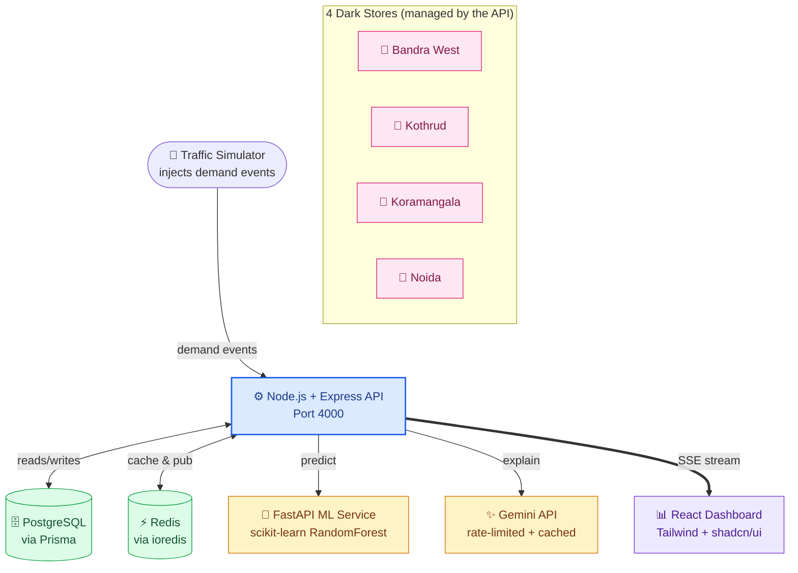

# SurgeOps

[](https://github.com/Kalpesh2409/surgeops/actions/workflows/ci.yml)

## Demo

<!-- TODO: Add demo GIF/recording here once captured. Suggested: record a full flow via `/simulator/demo-ramp` showing prices climbing from Normal → Elevated → Surge on the dashboard. -->

## Problem Statement

Dark stores in Indian quick-commerce operate on thin margins against highly volatile, hyperlocal demand — a heatwave spikes cold-drink orders, a downpour spikes staples, and static pricing/inventory rules can't keep up. Manual price reviews lag the spike; fixed markups leave margin on the table during stockout-risk windows; and inventory imbalances between stores go unaddressed.

**SurgeOps** simulates a real-time pricing and inventory system across four dark stores (Bandra West, Kothrud, Koramangala, Noida), pairing a rules engine with an ML demand model so the two can cross-check each other — with live state pushed to a dashboard via SSE.

## Tech Stack

| Layer | Technology |
|---|---|
| API | Node.js, Express, TypeScript |
| ML Service | Python, FastAPI, scikit-learn |
| Database | PostgreSQL, Prisma ORM |
| Cache / Real-time state | Redis (ioredis) |
| Frontend | React, TypeScript, Tailwind CSS v4, shadcn/ui |
| Real-time updates | Server-Sent Events (SSE) |
| AI explanations | Gemini API (free tier) |
| Infra | Docker Compose |
| CI/CD | GitHub Actions |

**Why these choices:**

- **Node.js + Express + TypeScript for the API** — type safety across a system with many moving pieces (pricing, inventory, simulator), and a mature ecosystem for building REST + SSE endpoints quickly.
- **Python + FastAPI + scikit-learn for ML, as a real server (not Jupyter)** — scikit-learn is the standard choice for a tabular regression problem like demand prediction, and FastAPI serves it as an actual microservice the Node API can call over HTTP — closer to how ML is deployed in production than a notebook would be.
- **PostgreSQL + Prisma** — relational data (stores, products, orders, price history) fits a relational model well, and Prisma gives type-safe queries and migrations without hand-written SQL.
- **Redis** — sub-second reads for live pricing/inventory state without hitting Postgres on every request; also used for caching Gemini explanations to stay within free-tier rate limits.
- **SSE over WebSockets** — the data flow is one-directional (server → dashboard), so SSE gives real-time push with a simpler protocol and no need for bidirectional messaging.
- **No message queue for MVP** — order volume in this simulation doesn't warrant the operational overhead of a queue; direct service calls keep the system simpler to reason about and to run at ₹0 cost.
- **Gemini API (free tier)** — the only free LLM option viable for generating human-readable pricing explanations, with rate limiting designed around its 5 RPM cap.
- **Docker Compose** — spins up Postgres, Redis, API, ML service, and frontend together with one command; no need for Kubernetes-level orchestration at this scale.
- **GitHub Actions** — free CI for a private repo, with real Postgres/Redis service containers so tests run against real infra, not mocks.

## Project Structure

```
surgeops/
├── .github/                      # GitHub Actions CI workflows
├── apps/
│   ├── api/                      # Node.js + Express + TypeScript API (port 4000)
│   │   ├── prisma/
│   │   │   ├── migrations/
│   │   │   ├── seed/
│   │   │   └── schema.prisma
│   │   ├── scripts/
│   │   │   ├── resetDemoData.ts
│   │   │   ├── runMLPricingSuggestions.ts
│   │   │   └── seedHistory.ts
│   │   └── src/
│   │       ├── __tests__/
│   │       ├── lib/                # prisma client, redis client, sseManager, inventoryStatus
│   │       ├── middleware/         # errorHandler
│   │       ├── routes/             # health, inventory, pricing, simulator, stores, stream
│   │       ├── services/           # pricingEngine, mlPricingSuggester, geminiExplainer,
│   │       │                       # demandIngestionLoop, orderSimulator, priceUpdateWriter, etc.
│   │       ├── app.ts
│   │       └── index.ts
│   ├── docs/                     # Project docs (e.g. demo rehearsal scripts)
│   ├── ml/                       # Python + FastAPI + scikit-learn ML service (port 8000)
│   │   ├── main.py                 # FastAPI app entry point
│   │   ├── train.py                # Model training script
│   │   ├── build_features.py
│   │   ├── model.pkl / product_encoder.pkl / store_encoder.pkl / avg_demand.pkl
│   │   └── requirements.txt
│   └── web/                      # React + TypeScript + Tailwind frontend
│       ├── public/
│       └── src/
│           ├── assets/
│           ├── components/
│           │   ├── ui/              # shadcn/ui primitives (badge, button, card, select, etc.)
│           │   ├── __tests__/
│           │   └── ZoneCard.tsx, PriceTable.tsx, StoreSelector.tsx,
│           │       InventoryPanel.tsx, MlComparisonPanel.tsx, TrafficSimulator.tsx, etc.
│           ├── hooks/               # usePriceStream, useMlComparison, useAnimatedNumber
│           ├── lib/                 # utils, zoneHeat
│           ├── App.tsx
│           └── main.tsx
├── .env.example
├── docker-compose.yml             # Postgres + Redis
├── LICENSE
└── README.md
```
## Architecture



## Setup & Run Instructions

### Prerequisites
- Node.js (v20+)
- Python 3.13
- Docker & Docker Compose

### 1. Clone and configure environment
```bash
git clone https://github.com/Kalpesh2409/surgeops.git
cd surgeops
cp .env.example .env
```
Edit `.env` and add your own `GEMINI_API_KEY` (free tier — [get one here](https://ai.google.dev/)).

### 2. Start Postgres and Redis
```bash
docker-compose up -d
```

### 3. Set up and start the API (port 4000)
```bash
cd apps/api
npm install
npx prisma generate
npx prisma migrate dev
npx tsx prisma/seed/index.ts
npm run dev
```
API will be running at `http://localhost:4000`.

### 4. Set up and start the ML service (port 8000)
```bash
cd apps/ml
python -m venv venv
.\venv\Scripts\Activate.ps1   # Windows
# source venv/bin/activate    # macOS/Linux
pip install -r requirements.txt
uvicorn main:app --reload --port 8000
```

### 5. Set up and start the frontend
```bash
cd apps/web
npm install
npm run dev
```
Frontend will be running at the Vite dev URL shown in the terminal (typically `http://localhost:5173`).

### 6. Trigger a demo
```bash
curl -X POST http://localhost:4000/simulator/demo-ramp \
  -H "Content-Type: application/json" \
  -d '{"storeId": "store-mumbai-bandra"}'
```

## Key Features
​
- **Real-time SSE dashboard** — live pricing and inventory updates pushed to the frontend as they happen, no polling
- **Rules engine + ML cross-check** — a deterministic pricing engine runs alongside a scikit-learn demand model, surfacing both for comparison
- **AI-generated pricing explanations** — Gemini API explains *why* a price changed, in plain language, cached to respect free-tier limits
- **4 simulated dark stores** — Mumbai Bandra West, Pune Kothrud, Bangalore Koramangala, Delhi Noida, each with independent pricing/inventory state
- **Traffic Simulator** — inject synthetic demand events to trigger surge pricing scenarios on demand, without waiting for real traffic
- **Fully containerized dev environment** — Postgres + Redis via Docker Compose, with CI running the same services in GitHub Actions
​
## Future Scope
​
- **Live store integration** — the Traffic Simulator currently injects synthetic demand events to mimic real customer orders. Once a real store frontend/API exists, order events from that API would replace the simulator as the trigger — the downstream pipeline (rules engine, ML comparison, Redis caching, SSE broadcast) is already built to react to demand events generically, so this would mainly involve mapping real order data into the existing event shape and handling real-world concerns like retries and out-of-order delivery
- **Deployment** — deploy to Railway/Render for a live, publicly accessible demo (planned for Session 26)
- **Smooth scroll (Lenis)** — polish scroll behavior on the dashboard, deferred pending a dedicated session
- **Animation timing refinement** — revisit the Surge batch animation sequencing for multi-product updates after further review
- **Extended ML features** — explore rolling/lag demand features if richer (non-synthetic) data becomes available; deferred in earlier testing due to multicollinearity with synthetic data showing no measurable accuracy benefit
- **Per-store AI explanation budgets** — on a paid Gemini tier, move from a shared rate-limited budget to independent per-store explanation calls
​